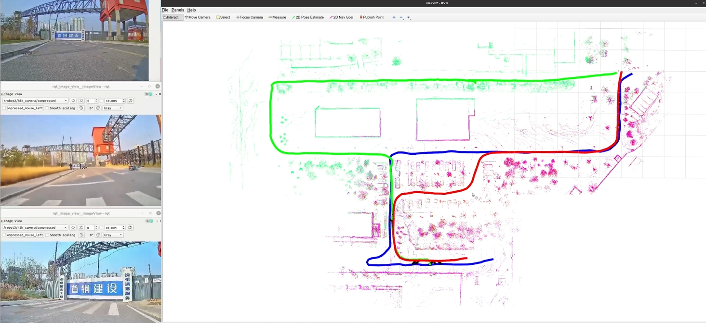
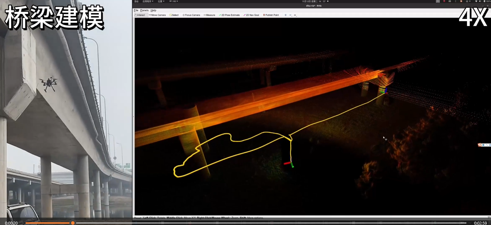

# 🎓 Graduate Research Projects（Incomplete）

This repository presents the main projects I conducted during my graduate studies, focusing on **multi-robot SLAM** and **autonomous navigation**.  

---

## 🚀 Project 1: Multi-Robot Cooperative SLAM

  
  

### 🌍 Overview
A bandwidth-efficient **multi-robot cooperative SLAM system** for large-scale exploration.  
Robots exchange **2.5D submaps** under bandwidth-limited communication and achieve global consistency via a **sliding window optimizer**.  

**Key Features:**
- 📡 Low-bandwidth 2.5D submap communication  
- 🧭 Sliding window optimization for global consistency  
- 🤝 Collaborative mapping in distributed environments  

### 📊 Results
- Reduced communication by **>30%** compared with 3D submaps  
- Achieved robust mapping in real-world multi-robot experiments  

  

-->
### 🎥 Demo Video
[]

## 🤖 Project 2: Autonomous Navigation System

### 🌍 Overview
An **indoor autonomous navigation system** designed for service robots operating in dynamic environments.  
The system integrates multi-sensor data and provides robust localization, mapping, and obstacle avoidance.  

**Key Features:**
- 🔎 Multi-sensor fusion (LiDAR, IMU, camera)  
- 🚧 Real-time obstacle detection & avoidance  
- 🛠 ROS-based modular implementation  

### 📊 Results
- Successfully deployed in a university building for long-term navigation tests  
- Demonstrated reliable performance in dynamic human-populated environments  

  

-->
